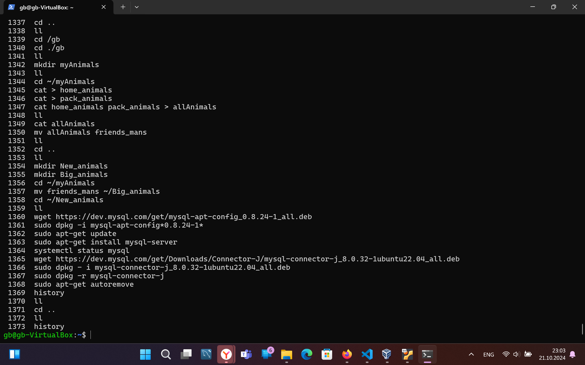

## Task 1

mkdir myAnimals
cd ~/myAnimals
cat > home_animals
cat > pack_animals
cat home_animals pack_animals > allAnimals
cat allAnimals
mv allAnimals friends_mans
ll

## Task 2

cd ..
mkdir Big_animals
cd ~/myAnimals
mv friends_mans ~/Big_animals
cd ~/New_animals
ll

## Task 3

wget https://dev.mysql.com/get/mysql-apt-config_0.8.24-1_all.deb
sudo dpkg -i mysql-apt-config*0.8.24-1*
sudo apt-get update
sudo apt-get install mysql-server
systemctl status mysql

## Task 4

wget https://dev.mysql.com/get/Downloads/Connector-J/mysql-connector-j_8.0.32-1ubuntu22.04_all.deb
sudo dpkg - i mysql-connector-j_8.0.32-1ubuntu22.04_all.deb
sudo dpkg -r mysql-connector-j
sudo apt-get autoremove

